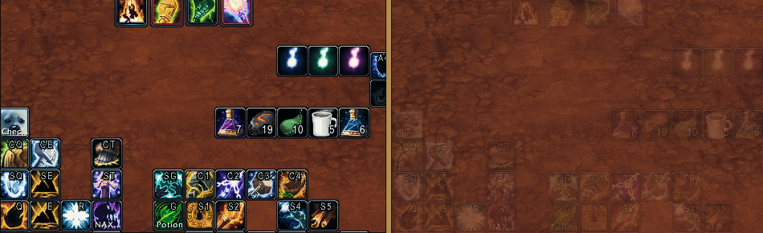

Fade in/out any frame (actionbars, map, dps meter, unitframes etc.) from any addon when entering/exiting combat.
Most of the code is generated with Junie + Claude Opus as I'm not comfortable with the WoW 1.12 API, but the principles are so simple that the code is really not that complex.

`/feid` to configure, "Identify" to get frame name by clicking on a UI element or enter the name manually. Supports any addon and original UI, except for those that are already fading their opacity.

Detailed instructions coming later.